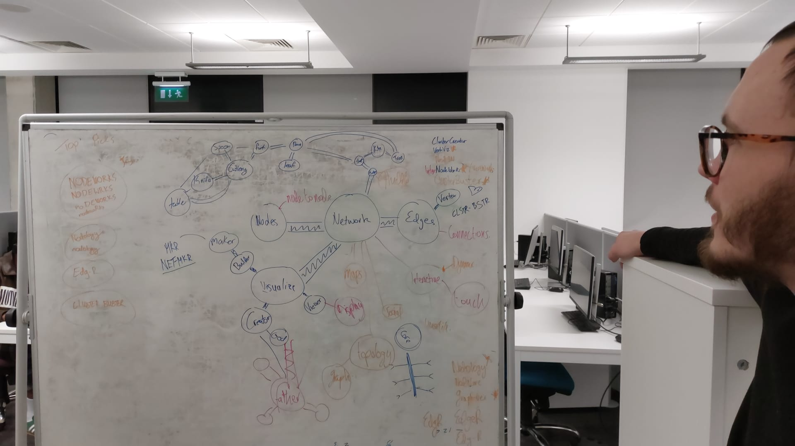

# noDEWORKS
Dynamic, Interactive, node edges builder. Network Graphing tool. 

### Inspiration
This was inspired by my SPUR project from summer 2024. Where we were making social networks of Industries and different researchers in Maynooth.  

### Background
I had used igraph and visnetwork before. I thought that it would be interesting to add some sort of interactive element, where you can make connections and nodes.  

### Name
Owen O'Connor and I came up with the name on a Friday evening.  

### Shiny App link
https://louisthomas.shinyapps.io/noDEWORKS/

### Improvements
I had a function for load your own data - it would crash and load up the non existent files from some temporary data. 

### Wall of Shame
> Shame! Shame! Shame 😭  
> This is the list of bugs that is discovered after the submission

- For some reason adding new nodes, i.e. pressing add new node. Results in the wiping of the displayed edge table.  
  Don't panic! If you press arrange table it will bring back the table with your changes.  
- In the help section - of the Shiny App - I have two images, that is not being displayed: 
  - One on the name brainstorm
  - One the map of Dark Souls 1, with it geographically placed in the right locations.  
